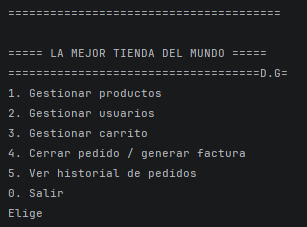
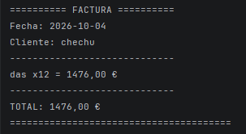

# Sistema de Gestión de Inventario

Práctica de repaso de Java (Pre Backend) para 2º DAW. Es una tienda por consola, sin interfaz gráfica, que se maneja con `Scanner` y `System.out`.

**Alumno:** David Galán Ruiz
**Grupo:** 2º DAW

## Cómo ejecutarlo

1. Abrir el proyecto en IntelliJ.
2. Ejecutar la clase `Main`.
3. Usar el menú con los números.

## Qué hace

El programa tiene un menú principal en bucle con estas opciones:

1. **Gestionar productos:** alta, baja, listado y búsqueda por categoría o por precio.
2. **Gestionar usuarios:** alta, baja y listado de usuarios activos.
3. **Gestionar carrito:** añadir producto, quitar producto y ver el total.
4. **Cerrar pedido:** pasa el carrito a factura, la muestra por consola y la guarda en el historial.
5. **Ver historial de pedidos.**
6. **Exportar historial a CSV.**
0. **Salir.**

## Estructura del proyecto

Lo he organizado con el patrón MVC:

- **Modelo:** `Producto`, `ProductoFisico`, `ProductoDigital`, `Usuario`, `Carrito`, `Factura` y las clases que guardan las listas (gestor de productos, gestor de usuarios e historial).
- **Vista:** `Vista`, que solo muestra menús y mensajes y pide los datos. No tiene lógica de negocio.
- **Controlador:** `Controlador`, que conecta la vista con el modelo y decide qué hacer con cada opción.
- **Main:** solo arranca el programa.

## Decisiones de diseño

- **`Producto` es abstracta.** No tiene sentido crear un producto "genérico", así que las subclases `ProductoFisico` (peso y gastos de envío) y `ProductoDigital` (tamaño de descarga y licencia) completan lo que falta. Cada una calcula su precio final a su manera, y ahí uso el polimorfismo.
- **Una sola lista de productos.** Guardo físicos y digitales juntos en una `List<Producto>`, así el listado, la búsqueda y la baja funcionan igual para todos sin repetir código.
- **El carrito usa un `Map<Producto, Integer>`.** Cada producto es una clave y su valor es la cantidad. Así no hay productos repetidos y es fácil sumar cantidades o quitar un producto.
- **IDs automáticos.** Cada clase tiene un contador `static` que asigna el id al crear el objeto, para que el usuario no tenga que escribirlo y no se repitan.
- **Copias defensivas.** Los getters de las listas y del carrito devuelven una copia (`new ArrayList<>(...)`) para que nadie pueda modificar la lista interna desde fuera.
- **Lectura por consola.** Leo todo con `nextLine()` y convierto después con `Integer.parseInt`, para evitar el problema del salto de línea que deja `nextInt()` en el buffer. Si el usuario escribe algo que no es un número, se le vuelve a pedir.

## Extra elegido: exportar el historial a CSV

**Por qué lo elegí:** Me pareció útil porque en una tienda real el historial de ventas se suele revisar en Excel, y además me sirvió para practicar el manejo de ficheros y excepciones IOException."

**Cómo funciona:** la clase `ExportadorCSV` recorre las facturas del historial y crea el fichero `historial_pedidos.csv` en la carpeta del proyecto, con las columnas Fecha, Cliente, Producto, Cantidad y Total.

Para que se vea bien al abrirlo en Excel en español:

- Uso `;` como separador de columnas, porque la coma es el separador decimal.
- Escribo los decimales con coma (`12,50`) para que Excel los reconozca como número.
- Guardo el fichero en UTF-8 con BOM para que se vean bien las tildes y el símbolo €.
- Escribo la fecha como `dd/MM/yyyy`.

**Cómo está integrado:** se lanza desde el menú principal (opción 6) y usa los mismos datos del historial que la opción 5, así que no es un añadido aparte.

## Capturas de ejecución

***Menú Principal***

***Facturaa***

